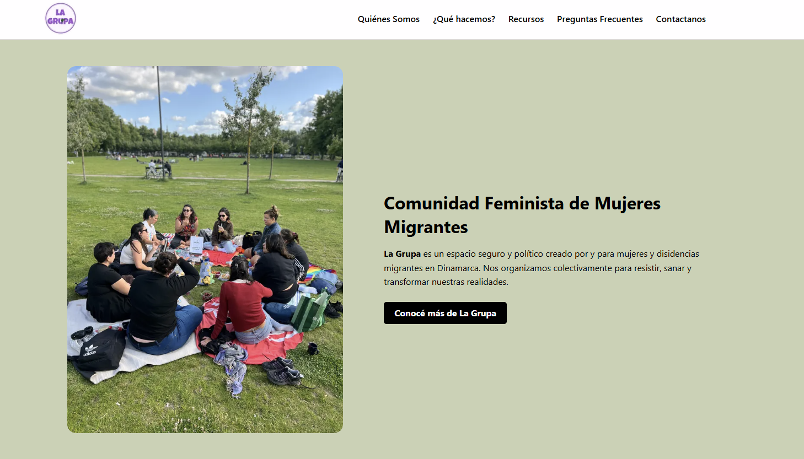

###

Bilingual website for **La Grupa DK**, a collective of migrant women in Denmark.  
The site shares resources, activities, events, and contact information in **Spanish (ES)** and **Danish (DA)**.

---

## 🚀 Technologies Used

- **Next.js (App Router)** – main framework
- **React** – components
- **TypeScript** – type safety
- **CSS Modules** – component-based styling
- **i18n (custom)** – translation system with `es.json` and `da.json`
- **React Icons** – social media icons
- **Vercel** – hosting/deployment

---

## 🛠️ How to Run Locally

1. Clone the repo
   ```bash
   git clone <your-repo-url>
   cd la-grupa-site
   ```

---

## Install dependencies

npm install

---

## Install development server

npm run dev

---

## See the site

Open http://localhost:3000
in your browser.

---

### Architecture Decisions

CMS: Sanity
I chose Sanity because its free tier covered the client's content needs, and defining schemas in code meant the content structure lives in version control alongside the rest of the codebase. I set up the schemas manually following Sanity's documentation. For a small NGO with non-technical editors, the Studio UI was usable without training.

Internationalization: Custom i18n
The site supports Spanish and Danish via two JSON translation files (es.json, da.json). I built a custom solution rather than reaching for next-intl or i18next because the requirements were simple — two languages, no pluralization, no complex locale routing. The lookup function was AI-assisted. If the site scaled to more languages or needed pluralization rules, I'd migrate to next-intl for its type-safe keys and built-in locale routing.

Styling: CSS Modules
CSS Modules was the team convention on this project. In retrospect, Tailwind would have enforced design consistency better across contributors. I'd make that case from the start on a future project of this size.

## 🌱 How to Contribute (Branches & Pull Requests)

If you want to make changes to the site, it’s best to create a **branch** (a copy of the code) so your edits don’t affect the main site until they are reviewed.

### 1. Create a New Branch

```bash
# Make sure you are on the main branch
git checkout main

# Pull the latest updates
git pull origin main

# Create a new branch (replace my-edit with your own name)
git checkout -b my-edit




© 2025 La Grupa DK. All rights reserved.

This repository and its contents are the exclusive property of La Grupa DK.
No part of this project, including code, design, or media, may be reproduced,
distributed, or used for commercial or non-commercial purposes without
explicit written permission from La Grupa DK.
```
